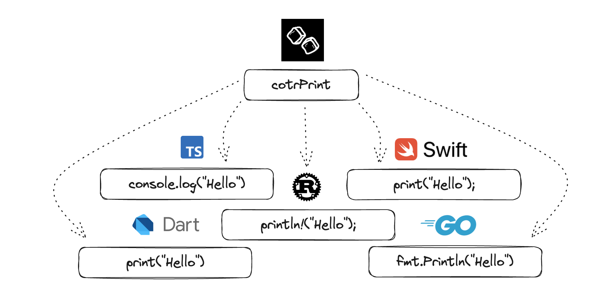

# Code on the Rocks 
At [Code on the Rocks](https://codeontherocks.dev/) (COTR) our mission is to enable developers to code fluently in every programming language. We create tools and resources to help you apply your high-level programming knowledge in any code base.

## COTR Snippets
This VS Code extension provides a large list of generic snippets that can be used in any project, regardless of the language used. 

How does it work? 

Its very simple, actually. A snippets file is created for every supported language with all of the snippets implementations. For example, the `dart.json` snippet file implements all of the snippets in Dart while the `typescript.json` file implements all of the snippets in TypeScript. **The key is that the snippet names are consistent across languages so you only need to remember the COTR snippet name**.

## Supported Languages
- [Dart](https://dart.dev/)
- [Swift](https://www.swift.org/)
- [JavaScript](https://www.javascript.com/)
- JavaScript React (JSX)
- [TypeScript](https://www.typescriptlang.org/)
- [TypeScript React (TSX)](https://react.dev/learn/typescript)
- [Go](https://go.dev/)
- [Rust](https://www.rust-lang.org/)
- [Kotlin](https://kotlinlang.org/)

## Snippets

| Name | Description |
| --- | --- |
| cotrString | The language's string data type |
| cotrInt | The language's integer data type |
| cotrNum | The language's numerical data type |
| cotrBool | The language's boolean data type |
| cotrNull | The language's null data type |
| cotrVar | Creates a variable |
| cotrConst | Creates a constant variable |
| cotrStaticVar | Creates a static variable |
| cotrMap | Creates a map/dictionary variable |
| cotrGenMap | Generates a map/dictionary with a specific number of key/value pairs |
| cotrList | Creates a list/array variable |
| cotrGenList | Generates a list/array of a specific length |
| cotrPrint | Creates a print/log statement |
| cotrForLoop | Creates a for loop |
| cotrForIn | Creates a for-in/of loop |
| cotrWhileLoop | Creates a while loop |
| cotrSwitch | Creates a switch stament with default |
| cotrFunc | Creates a function |
| cotrComment | Creates a single-line comment |
| cotrMultiComment | Creates a multi-line comment |
| cotrThrow | Throws an exception |
| cotrTryCatch | Creates a try-catch block |
| cotrIf | Creates an if statement |
| cotrIfElse | Creates an if-else statement |
| cotrTernary | Creates a ternary statement |